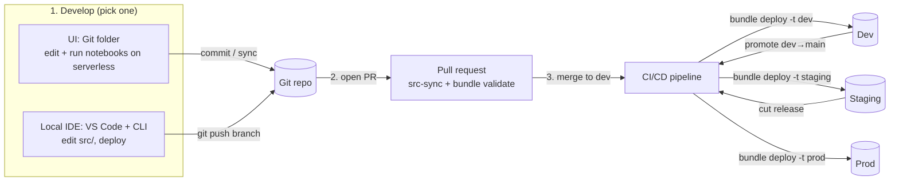

# Databricks MLOps Workshop

This repository contains the preparation materials for a 1-day Databricks MLOps workshop.

The workshop covers the full ML engineering lifecycle on Databricks: feature engineering, MLflow experiment tracking, model registry and governance, batch inference, model serving, and productionisation with Workflows and **Declarative Automation Bundles** (formerly Databricks Asset Bundles / DABs).

---

## The Dataset

The workshop uses the [Financial Transactions Fraud Dataset](https://www.kaggle.com/datasets/computingvictor/transactions-fraud-datasets)
from Kaggle. It is a public, synthetic dataset of consumer card activity that mirrors what a
real card issuer or payments processor works with, without any real customer data.

It is made up of five source files that join into a single fraud-detection problem:

| Source | Grain | Key columns |
|---|---|---|
| `transactions_data.csv` | one row per card transaction (~13M rows, spanning **2009-2019**) | `id`, `client_id`, `card_id`, `amount`, `date`, `mcc`, `use_chip`, `merchant_state` |
| `cards_data.csv` | one row per card | `id`, `client_id`, `card_brand`, `card_type`, `credit_limit`, `num_cards_issued` |
| `users_data.csv` | one row per client | `id`, `current_age`, `yearly_income`, `total_debt`, `credit_score`, `num_credit_cards` |
| `mcc_codes.json` | Merchant Category Code lookup | `mcc` → description |
| `train_fraud_labels.json` | fraud label per transaction | `transaction_id` → `is_fraud` |

These are ingested through a **medallion architecture** (landing → bronze → silver → gold)
and joined into a denormalised, labelled `transactions_enriched` gold table (37 columns)
that the ML labs build features from. The target, `is_fraud`, is **highly imbalanced**
(fraud is a fraction of a percent of transactions), which is deliberately realistic and is
what makes the workshop's evaluation, thresholding, and monitoring steps meaningful.

The dataset is **not shipped in this repo**. Download it from Kaggle and load it into the
landing volume (see [Load the data](#load-the-data) below).

---

## Environment Setup

The dev environment (Azure resources + Databricks workspace) lives in the `dev` Unity
Catalog. The Unity Catalog objects the workshop needs (the medallion schemas and the
landing volume) are declared as bundle resources in [databricks.yml](databricks.yml) and
created when you deploy the bundle to a clean target.

### Prerequisites

- **Databricks CLI** installed (`databricks version`).
- Authenticated to the workspace. Use **Azure CLI auth** (`az login` against the correct
  tenant), or configure a CLI profile.

### Run it

```powershell
# From the repo root. Creates the shared schemas + landing volume in the dev catalog.
databricks bundle deploy -t dev
```

The shared medallion schemas and `raw_data` volume are declared on the clean `dev` /
`staging` / `prod` targets (via the `shared_infra` anchor), so deploying to one of those
targets provisions them. Deploying to the default `personal` target (development mode) does
not, attendees read the shared, instructor-seeded schemas and write only to their own
`dev_<you>_fraud` schema.

### What it creates (under the `dev` catalog)

| Object | Type | Purpose |
|---|---|---|
| `dev.fraud_landing` | schema | Landing zone for raw source files stored in volumes |
| `dev.fraud_bronze` | schema | Bronze layer: raw ingested fraud data |
| `dev.fraud_silver` | schema | Silver layer: cleaned, typed, joined data |
| `dev.fraud_gold` | schema | Gold layer: shared curated **source** (`transactions_enriched`) read by all users |
| `dev.fraud_landing.raw_data` | managed volume | Landing zone for raw source files (CSV/JSON), one folder per dataset |

`fraud_gold` holds the **shared curated source**
(`transactions_enriched`) that everyone reads. Each attendee's own outputs (feature
tables, registered model, batch predictions and monitoring metrics) go to their personal
`dev_<you>_fraud` schema (see "Data isolation" below), so 20 people never collide. In
**production** a single pipeline would instead write these outputs to the shared `fraud`
schema. MLflow **experiments** are workspace objects (a `/Users/...` path), not a Unity
Catalog schema.

> **Note: the `dev` catalog itself is not created by the bundle.** This account has
> Databricks **Default Storage** enabled, and a Default Storage catalog can currently only
> be created via the Catalog Explorer UI (**Catalog → Create catalog → Default storage**).
> Create the catalog once, then deploy the bundle to provision the schemas and volume.

### Load the data

The dataset is **not shipped in this repo**. Download it from Kaggle and upload it to the
landing volume, then run the ingestion job.

1. **Download** the [Financial Transactions Fraud Dataset](https://www.kaggle.com/datasets/computingvictor/transactions-fraud-datasets)
   from Kaggle (sign in and accept the dataset terms). You need five files:
   `transactions_data.csv`, `cards_data.csv`, `users_data.csv`, `mcc_codes.json`,
   `train_fraud_labels.json`. The Kaggle CLI works too:

   ```powershell
   kaggle datasets download -d computingvictor/transactions-fraud-datasets -p .tmp/kaggle --unzip
   ```

2. **Upload** each file into its own folder in the landing volume
   `dev.fraud_landing.raw_data` (one folder per dataset), e.g. via the Catalog Explorer UI
   or the CLI:

   ```powershell
   databricks fs cp .tmp/kaggle/transactions_data.csv   dbfs:/Volumes/dev/fraud_landing/raw_data/transactions/
   databricks fs cp .tmp/kaggle/cards_data.csv          dbfs:/Volumes/dev/fraud_landing/raw_data/cards/
   databricks fs cp .tmp/kaggle/users_data.csv          dbfs:/Volumes/dev/fraud_landing/raw_data/users/
   databricks fs cp .tmp/kaggle/mcc_codes.json          dbfs:/Volumes/dev/fraud_landing/raw_data/mcc_codes/
   databricks fs cp .tmp/kaggle/train_fraud_labels.json dbfs:/Volumes/dev/fraud_landing/raw_data/fraud_labels/
   ```

3. **Run the ingestion job** (`resources/data-ingestion-workflow.yml`) to build bronze → silver →
   gold: `databricks bundle run data_ingestion_job -t dev`. Attendees start from the resulting
   silver/gold tables and never touch the raw files.

---

## The ML Use Case: Fraud Detection

A single fraud-detection problem runs through every session, so the MLOps lifecycle has
something concrete to carry end-to-end.

### The problem

**Supervised binary classification.** Predict whether a card transaction is fraudulent
(`is_fraud` = true/false). The dataset is **highly imbalanced** (fraud is a fraction of a
percent of transactions), which is deliberately realistic and makes the workshop's
evaluation, thresholding, and monitoring steps meaningful.

- **Target:** `is_fraud` (from `train_fraud_labels`).
- **Grain:** one row per transaction (`transaction_id`).
- **Source:** the gold `transactions_enriched` table, with transaction, card, user and
  merchant-category attributes already joined (37 columns).

### Features (real-time split)

Scoring has to work for a brand-new transaction that isn't in any table yet, so features are
split the way production systems do:

- **Entity features (looked up by key at serving time):**
  - **Card** (`card_features`, by `card_id`): `credit_limit`, `num_cards_issued`.
  - **Client** (`client_features`, by `client_id`): `credit_score`, `yearly_income`,
    `current_age`.
- **On-demand features (computed from the request by UC feature functions):** `is_night`,
  `is_online`, `is_high_risk_mcc`, `amount_to_income_ratio`, `amount_to_credit_limit_ratio`.

The same feature definitions are used at training and serving, so there is no train/serve skew.

### Proposed models (progression)

We deliberately keep models simple so the focus stays on the **MLOps lifecycle**, not
hyper-tuning. We train a progression and let MLflow pick a champion:

| Stage | Model | Why |
|---|---|---|
| Trap | **Random Forest** (raw imbalanced data) | Shows the imbalance trap: ~99.8% accuracy but recall ≈ 0 (flags no fraud) |
| Fixed / registered | **Random Forest** (balanced training data) | Keep all fraud + down-sample non-fraud so the model actually catches fraud; evaluated on the real imbalanced test set. This is the version registered + promoted |

Class imbalance is handled by **balancing the training data** (keep every fraud row,
down-sample non-fraud to a 1:1 ratio), not by class weights. The model is still evaluated on
the untouched, imbalanced test set. The notebook also walks through the precision/recall
trade-off this creates and why the decision threshold is a business choice.

### Evaluation metrics

Accuracy is misleading on imbalanced data, so we track:

- **ROC-AUC**, the metric the promotion gate scores the model on.
- **precision**, **recall**, **F1** (macro), and accuracy for context.
- A **confusion matrix** and precision/recall trade-off for the "champion vs. challenger"
  discussion in the promotion session.

### How it maps to the workshop

| Session | What we do with the model |
|---|---|
| Model Development | Build features (Feature Store), train the progression, log to MLflow |
| Governance | Govern the model registered during training; aliases, versioning + lineage |
| Promotion | Validate against the ROC-AUC gate; champion/challenger; None→Dev→Staging→Prod |
| Serving | Deploy champion via the deployment job; test the endpoint with `query_endpoint` |
| Monitoring | Batch-score to an inference table; watch drift + precision/recall; trigger retrain |

> **The Serving step is slow.** The deployment job (`fraud_deployment_job`) provisions a
> **Lakebase online feature store**, publishes the `card_features`/`client_features` tables to
> it, and builds a first-time serving endpoint, which typically takes **15-25 minutes**
> end-to-end. It runs automatically when a new model version is registered; let it run while
> you talk through the concepts. Once it's ready, run `deployment/model_deployment/notebooks/query_endpoint.py`
> to score live transactions against the endpoint (this also seeds the online monitor's traffic).

---

## How you work with this repo (developer workflow)

This repo is a **Declarative Automation Bundle** (formerly a Databricks Asset Bundle / DAB) with a
`databricks.yml` at the root. You
develop either **in the Databricks UI** or **in a local IDE**, commit to Git, and let
**CI/CD** promote the bundle through environments. You don't edit prod directly.



### 1. Develop: two ways to edit

Both are officially supported; use whichever you prefer.

**a) In the Databricks UI (Git folder, no local install)**
1. In the workspace: **Workspace → Create → Git folder**, paste this repo's URL, **Clone**.
2. Because `databricks.yml` is at the root, Databricks recognises the folder as a **bundle**
   and shows a bundle editor (target switcher + Deploy).
3. Open a notebook under `src/` (the version with TODO gaps you fill in) or `solution/` (the
   complete reference) and **run it on serverless compute**, or use
   the bundle editor to pick target `personal` → **Deploy** → **Run** a job, all from the UI, no
   YAML or CLI needed. Requires **serverless compute enabled**.

**b) In a local IDE (VS Code + Databricks CLI)**
1. `git clone` the repo locally.
2. Edit `solution/` (the source of truth), run `python scripts/generate_src.py` to refresh the
   gapped `src/`, then `databricks bundle deploy -t personal` and
   `databricks bundle run <job> -t personal` to push to your own user-prefixed namespace.

In **both** cases the `personal` target is `mode: development`: resources are prefixed with your
username and schedules are paused, so multiple developers never collide in one workspace.

### 2. Commit

Work on a **short-lived feature branch**. In the UI, commit/sync via the Git folder; locally,
`git commit` and push. Everything (notebooks, `src/`, `resources/*.yml`, `databricks.yml`) is
version-controlled, and the Git repo is the single source of truth.

### 3. CI/CD promotes the bundle (dev → staging → prod)

Open a **pull request** → CI checks `src/` is in sync with `solution/` and runs `bundle validate`. On **merge to `dev`**, the
CI/CD pipeline runs `bundle deploy` to the **dev** integration environment; promoting
**`dev` → `main`** deploys to **staging**. Cutting a **release** (a `release/**` branch or a
`vX.Y.Z` tag) deploys to **prod** behind a manual approval. Every environment deploy uses a
**service principal**, not your personal account. (Note: the in-UI bundle editor can
only deploy to *this* workspace's `personal`; cross-workspace staging/prod promotion always goes
through CI/CD.)

The promotion unit is **code, not the model**: the same reviewed pipeline runs in each
environment and trains on that environment's data.

The actual workflows live in this repo. See
[CI/CD: promoting the bundle across environments](#cicd-promoting-the-bundle-across-environments)
for the GitHub Actions setup and the release-branch model.

---

## CI/CD: promoting the bundle across environments

The `databricks.yml` declares three targets (`dev`, `staging`, `prod`), each pointing at its
own Unity Catalog (`dev` / `staging` / `prod`). CI/CD's job is to take the **same reviewed
Declarative Automation Bundle** and deploy it to each environment in turn. Nothing about the model
is copied between environments; the identical code is redeployed and re-runs against that
environment's data.

### Branching model (multi-env with a release branch)

```mermaid
gitGraph
    commit id: "dev"
    branch feature/xyz
    commit id: "work"
    checkout dev
    merge feature/xyz tag: "PR: CI validate + src-sync"
    commit id: "→ deploy DEV" type: HIGHLIGHT
    branch main
    commit id: "promote dev→main"
    commit id: "→ deploy STAGING" type: HIGHLIGHT
    branch release/1.0
    commit id: "cut release"
    commit id: "→ deploy PROD (approval)" type: HIGHLIGHT
```

| Stage | Trigger | Target | Auth | Gate |
|---|---|---|---|---|
| **CI** | PR to `dev` / `main` | n/a (validate only) | none | branch protection: src-sync + `bundle validate` must pass |
| **Dev** | push/merge to `dev` | `-t dev` | dev service principal | automatic |
| **Staging** | push/merge to `main` | `-t staging` | staging service principal | automatic |
| **Prod** | `release/**` branch **or** `vX.Y.Z` tag | `-t prod` | prod service principal | **manual approval** (GitHub Environment reviewer) |

- A developer opens a **PR** from a short-lived `feature/*` branch into `dev`. CI
  ([.github/workflows/ci.yml](.github/workflows/ci.yml)) lints, checks `src/` is in sync with
  `solution/`, and (in a real setup) runs `databricks bundle validate`.
- Merging to **`dev`** auto-deploys to the **dev** environment, an integration environment where
  the pipeline runs end-to-end before it reaches staging.
- Promoting **`dev` → `main`** auto-deploys to **staging** so the pipeline runs against
  real staging data.
- To ship, you **cut a release**: either branch `release/1.0` off `main` or tag a commit
  `v1.0.0`. That triggers the **prod** deploy, which **pauses for a human to approve** before
  it runs.

> **Note on `dev` vs `personal`.** `dev` is a **clean** shared environment (no name-prefixing):
> CI deploys `-t dev` as the dev service principal to a single copy that reads and writes the
> shared `dev.fraud_*` schemas, giving a team integration environment. Individual attendees never use
> `dev`; they deploy the **`personal`** target (`mode: development`), which prefixes every
> resource with `[dev <you>]` and isolates their writes to a personal `dev_<you>_fraud` schema.
> The two coexist in the same workspace without colliding.

### The workflow

The CD workflow lives in [.github/workflows/cd.yml](.github/workflows/cd.yml). The core of it:

```yaml
on:
  push:
    branches:
      - dev                 # -> dev
      - main                # -> staging
    tags: ["v*.*.*"]        # -> prod (release tag)

permissions:
  contents: read
  id-token: write           # let GitHub mint the OIDC token for federation

jobs:
  deploy-dev:
    if: github.ref == 'refs/heads/dev'
    runs-on: ubuntu-latest
    environment: dev                      # holds the dev SP config + federation policy
    env:
      DATABRICKS_AUTH_TYPE: github-oidc
      DATABRICKS_HOST: ${{ vars.DATABRICKS_HOST }}
      DATABRICKS_CLIENT_ID: ${{ secrets.DATABRICKS_CLIENT_ID }}
    steps:
      - uses: actions/checkout@v4
      - uses: databricks/setup-cli@v0.9.0
      - run: databricks bundle validate -t dev
      - run: databricks bundle deploy -t dev

  deploy-staging:
    if: github.ref == 'refs/heads/main'
    runs-on: ubuntu-latest
    environment: staging                  # holds the staging SP config + federation policy
    env:
      DATABRICKS_AUTH_TYPE: github-oidc
      DATABRICKS_HOST: ${{ vars.DATABRICKS_HOST }}
      DATABRICKS_CLIENT_ID: ${{ secrets.DATABRICKS_CLIENT_ID }}
    steps:
      - uses: actions/checkout@v4
      - uses: databricks/setup-cli@v0.9.0
      - run: databricks bundle validate -t staging
      - run: databricks bundle deploy -t staging

  deploy-prod:
    if: startsWith(github.ref, 'refs/tags/v') || startsWith(github.ref, 'refs/heads/release/')
    runs-on: ubuntu-latest
    environment: production               # add a required-reviewer rule here to gate prod
    env:
      DATABRICKS_AUTH_TYPE: github-oidc
      DATABRICKS_HOST: ${{ vars.DATABRICKS_HOST }}
      DATABRICKS_CLIENT_ID: ${{ secrets.DATABRICKS_CLIENT_ID }}
    steps:
      - uses: actions/checkout@v4
      - uses: databricks/setup-cli@v0.9.0
      - run: databricks bundle validate -t prod
      - run: databricks bundle deploy -t prod
```

### Wiring it up (what a real setup needs)

1. **Service principals.** Create one Databricks service principal per environment and grant
   it deploy/run permissions in that workspace. Deploys run as the SP, never a person, so prod
   code isn't tied to anyone's account. (`prod` is `mode: production`, which deploys a single
   copy to a fixed `root_path`; see [databricks.yml](databricks.yml).)
2. **Workload identity federation (OIDC).** Give each SP a GitHub Actions federation policy
   whose subject matches this repo and the GitHub Environment, e.g.
   `repo:<org>/<repo>:environment:production`. This lets the workflow authenticate with a
   short-lived OIDC token, so there is **no long-lived secret to store or rotate** (Databricks'
   most secure option).
3. **GitHub Environments.** Create `dev`, `staging` and `production` environments
   (**Settings → Environments**). On each, set `DATABRICKS_HOST` as an environment **variable**
   and `DATABRICKS_CLIENT_ID` (the SP application id) as an environment secret. The workflow
   sets `DATABRICKS_AUTH_TYPE: github-oidc` and needs `id-token: write`. Add a
   **required reviewer** to `production` so the prod deploy waits for approval.
4. **Branch protection.** Require the CI checks to pass and a review before a PR can merge to
   `dev` or `main`, so only validated code reaches an environment.

The bundle already encodes the environment differences: `auto_approve` is `"true"` on `dev`
and `"false"` on staging/prod (so the in-bundle deployment job requires a human UC-tag
approval outside dev), and the shared medallion schemas are only provisioned on the non-dev
targets. CI/CD just picks the target, and the bundle does the rest.

---

## Data isolation: shared reads, personal writes

Attendees **read** from shared medallion data but **write** to their **own** schema, so 20
people never overwrite each other. This is wired through the bundle so it "just works" when
each attendee clones the repo and deploys.

> **Why a personal schema and not more medallion layers?** Medallion (bronze/silver/gold) and
> personal schemas are two *different, orthogonal* Databricks best practices, and both apply
> here:
> - **Medallion** organises the *shared enterprise data* by quality. It's "a recommended best
>   practice but not a requirement" and each layer lives in its own schema of a shared catalog
>   ([medallion docs](https://docs.databricks.com/aws/en/lakehouse/medallion)). Our shared
>   `fraud_bronze/silver/gold` (including the gold `transactions_enriched`) is unchanged.
> - **Personal schemas** isolate each *developer's own outputs* in dev. Databricks explicitly
>   recommends "a personal schema per user, for example `dev_${user_name}`… This prevents
>   developers from overwriting each other's tables"
>   ([developer best practices → Configure personal schemas](https://docs.databricks.com/aws/en/developers/best-practices)).
>
> So each attendee still *reads* the shared medallion; their feature tables / model / predictions
> are dev outputs that go in their personal `dev_<you>_fraud` schema. In **production** one
> pipeline would instead write the feature tables to the shared schema. We don't sub-layer
> the personal schema into bronze/silver/gold, since that's a shared-data concept, and doing so
> per user would explode the schema count.

**Shared, read-only** (instructor provisions once):

- `dev.fraud_landing` / `dev.fraud_bronze` / `dev.fraud_silver`
- `dev.fraud_gold.transactions_enriched` (the labelled source)

**Personal, per-user** (created automatically on deploy):

- `dev.dev_<you>_fraud.card_features` / `client_features`, the registered model, predictions, etc.

### How the per-user schema works

The bundle declares the schema with a **base name** in [resources/schemas-resource.yml](resources/schemas-resource.yml):

```yaml
resources:
  schemas:
    user_workspace:
      catalog_name: ${var.catalog_name}
      name: fraud
```

In **development mode** the bundle automatically prepends `[dev <your-short-name>]` to every
resource name (sanitised for schemas), so `fraud` becomes **`dev_<you>_fraud`**, a private
schema per user. In **production mode** there is no prefix, so it stays the shared `fraud`.
This prefixing is a built-in feature of development mode.

Jobs then pass the schema's **resolved** name to the notebooks so they always write to exactly
what the bundle created:

```yaml
base_parameters:
  gold_schema: ${var.gold_schema}                      # shared read  -> fraud_gold
  user_schema: ${resources.schemas.user_workspace.name} # personal write -> dev_<you>_fraud
```

and the model name follows the same schema:
`${var.catalog_name}.${resources.schemas.user_workspace.name}.fraud_detection`.

> **Why reference the resource, not a plain variable?** Development mode prefixes the schema
> *resource* but not a hand-written variable, so a variable like `${short_name}_fraud` would
> not match the schema the bundle actually creates. Referencing
> `${resources.schemas.user_workspace.name}` guarantees notebooks and the provisioned schema
> use the identical name.

### Attendee flow

1. Clone the repo as a **Git folder** in the workspace (it's recognised as a bundle).
2. **Deploy** the **`personal`** target from the bundle UI; this creates your `dev_<you>_fraud`
   schema and your `[dev <you>]` jobs.
3. Run the jobs / notebooks: reads hit the shared data, writes land in your own schema.

The `bundle deploy` creates every schema/volume the notebooks use, so run it before running
any job or notebook. The notebooks do not create schemas themselves.

---


## Repository Structure

The repo follows the Declarative Automation Bundle (formerly Databricks Asset Bundle) / mlops-stacks layout.

```
databricks-mlops-workshop/
  databricks.yml                     ← root Declarative Automation Bundle (variables, includes, dev/staging/prod targets)
  README.md                          ← this file
  resources/                         ← DAB YAML only (jobs, model, experiment, monitor)
    data-ingestion-workflow.yml      ← instructor-only landing→bronze→silver job
    feature-engineering-workflow.yml  ml-artifacts-resource.yml
    model-training-workflow.yml       deployment-job-workflow.yml
    batch-inference-workflow.yml      monitoring-resource.yml
  solution/                          ← complete notebooks, source of truth (with TODO markers)
    data_ingestion/notebooks/        ← instructor-only data loaders (landing→bronze→silver)
    feature_engineering/notebooks/   ← notebook entrypoints per stage (mlops-stacks convention)
    training/notebooks/
    deployment/batch_inference/notebooks/  deployment/model_deployment/notebooks/
    monitoring/notebooks/
  src/                               ← generated from solution/ with TODO gaps; the bundle deploys this
  scripts/
    generate_src.py                  ← regenerates src/ from solution/
```

Every stage follows the same shape: **notebook entrypoints live in `<stage>/notebooks/`**
(standard Databricks notebooks, `# Databricks notebook source`), and any importable helper
modules sit alongside the notebook that uses them. This mirrors the
`databricks/mlops-stacks` layout.

---

## Hands-on labs

The workshop is a sequence of hands-on labs. Each lab maps to an agenda session and to a
stage in the module tree. The complete solutions live in `solution/`; the versions with TODO
gaps are generated into `src/`, which is what the bundle deploys to attendees.

| # | Lab | Agenda session | Module |
|---|---|---|---|
| 1 | Feature engineering | Model Development & Experimentation | `feature_engineering` |
| 2 | Experiment tracking & training | Model Development & Experimentation | `training` |
| 3 | Registry & governance | Model Management & Governance | `training` (registered model) |
| 4 | Model promotion | Model Promotion Lifecycle | `deployment/model_deployment` |
| 5 | Batch inference | Model Serving & Consumption | `deployment/batch_inference` |
| 6 | Model serving | Model Serving & Consumption | `deployment/model_deployment` |
| 7 | Inference monitoring | Monitoring & Retraining | `monitoring` |
| 8 | Retraining workflow | Monitoring & Retraining | `monitoring` + `training` |

**1. Feature engineering.** Build `card_features` and `client_features` feature tables in
Unity Catalog plus on-demand feature functions, so features are governed, reusable, and
consistent between training and serving.

**2. Experiment tracking & training.** Assemble a training set with `FeatureLookup`, track
runs in MLflow, compare a baseline against the tuned model, and register the champion with a
signature and input example.

**3. Registry & governance.** Work with the registered model in Unity Catalog: tags,
description, aliases, lineage, and access control.

**4. Model promotion.** Validate the candidate against a metric gate, then promote it with
`@Champion` / `@Challenger` aliases, decoupling deployment from the inference code.

**5. Batch inference.** Score data with automatic feature lookup by loading the model by
alias, writing predictions (with the model version) for monitoring.

**6. Model serving.** Publish features to the online store and serve the champion from a
Mosaic AI serving endpoint; query it with a brand-new transaction.

**7. Inference monitoring.** Profile both the batch predictions and the live serving traffic
with Lakehouse Monitoring to watch drift and model quality over time.

**8. Retraining workflow.** Trigger retraining from a monitoring signal, so a retrained and
promoted model rolls out with no change to the inference code.

---

## Files and Folders

### `solution/` and `src/`

`solution/` is the source of truth (complete, runnable notebooks). Solution blocks are wrapped
in `# TODO-BEGIN … # TODO-END` markers; `scripts/generate_src.py` strips them to produce
the gapped version in `src/`, which is the tree the bundle deploys to attendees. Never
hand-edit `src/`; edit `solution/` and regenerate.

`solution/data_ingestion/` holds the **instructor-only** data loaders. They carry no TODO
gaps, so the generator copies them into `src/` verbatim; attendees don't run them (the
instructor seeds the shared data once before the workshop).

| Notebook | Purpose |
|---|---|
| `src/data_ingestion/notebooks/load_landing_to_bronze.py` | Reads raw CSV/JSON from the landing volume `dev.fraud_landing.raw_data` (one folder per dataset), applies schemas + audit columns, writes bronze tables to `dev.fraud_bronze` |
| `src/data_ingestion/notebooks/load_bronze_to_silver.py` | Cleans, types, dedupes and conforms the bronze tables into normalized silver tables in `dev.fraud_silver`, then builds the denormalized, labelled `dev.fraud_gold.transactions_enriched` consumption table |

Run once before the workshop via the DAB job `resources/data-ingestion-workflow.yml`. Both notebooks
are parameterised via `dbutils.widgets`, so catalog/schema/volume can be overridden at runtime.
Attendees start from the **silver** table.

---

## Databricks Environment

| Item | Value |
|---|---|
| Catalog | `dev` |
| Landing | schema `fraud_landing`, volume `raw_data` (one folder per dataset) |
| Bronze / Silver / Gold | schemas `fraud_bronze`, `fraud_silver`, `fraud_gold` (tables unprefixed; `transactions_enriched` is a gold consumption table) |
| ML artifacts | per-user schema `dev_<you>_fraud` (feature tables, registered model, predictions); experiments live at `/Users/<you>/...` |
| Compute | Shared classic clusters (LTS ML Runtime) |
| Model Serving | Available |

Unity Catalog objects (the medallion schemas and landing volume) are declared as bundle
resources and created with `databricks bundle deploy -t dev`. The catalog itself is created
once in the Catalog Explorer UI (Default Storage).

---

## Contributing

This project welcomes contributions and suggestions. See [CONTRIBUTING.md](CONTRIBUTING.md).
Most contributions require you to agree to a Contributor License Agreement (CLA); details at
https://cla.opensource.microsoft.com. This project has adopted the
[Microsoft Open Source Code of Conduct](CODE_OF_CONDUCT.md). To report a security issue, see
[SECURITY.md](SECURITY.md). For help, see [SUPPORT.md](SUPPORT.md).

## License

Released under the [MIT License](LICENSE).

## Trademarks

This project may contain trademarks or logos for projects, products, or services. Authorized
use of Microsoft trademarks or logos is subject to and must follow
[Microsoft's Trademark & Brand Guidelines](https://www.microsoft.com/en-us/legal/intellectualproperty/trademarks/usage/general).
Use of Microsoft trademarks or logos in modified versions of this project must not cause
confusion or imply Microsoft sponsorship. Any use of third-party trademarks or logos is subject
to those third-parties' policies.
